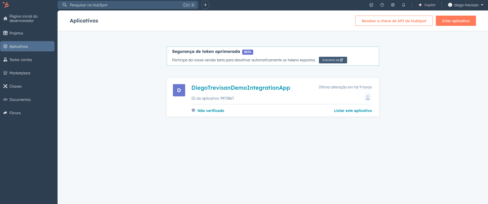
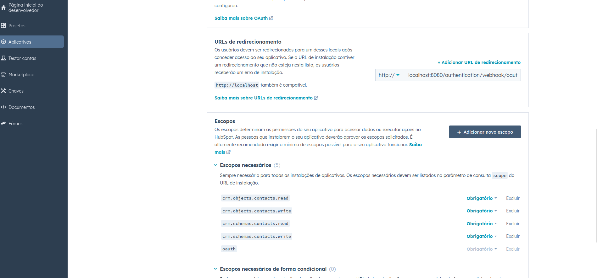
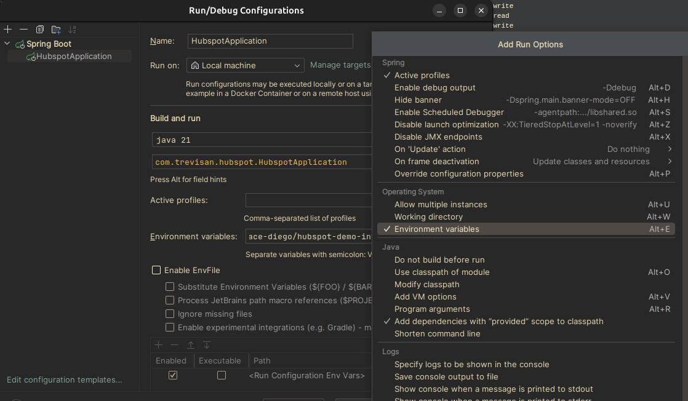
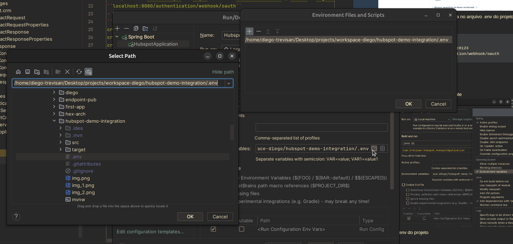
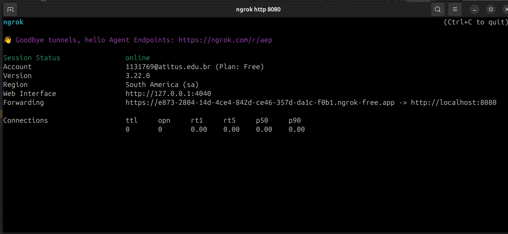
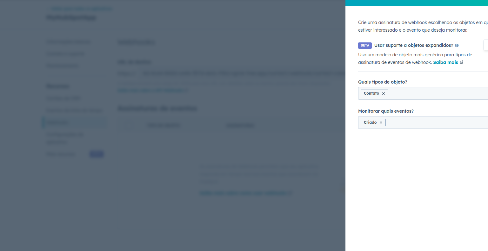
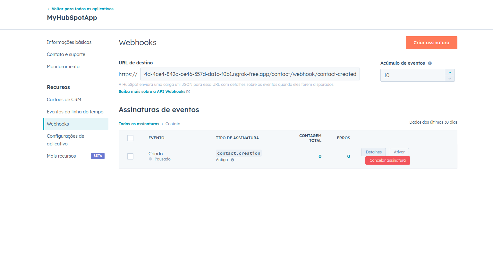
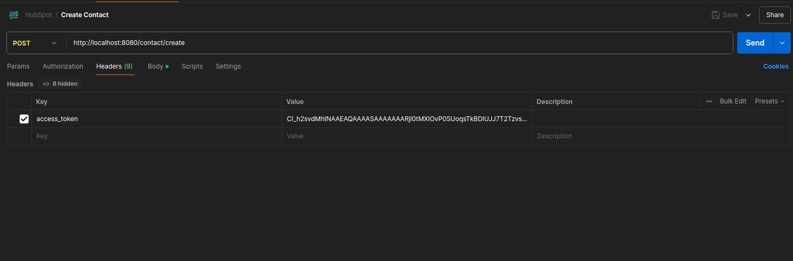
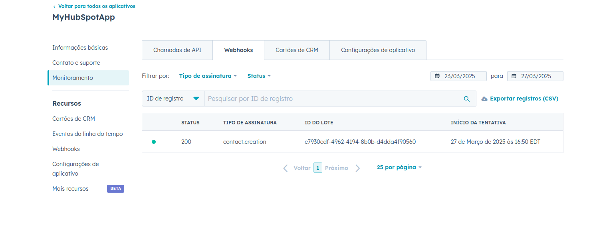
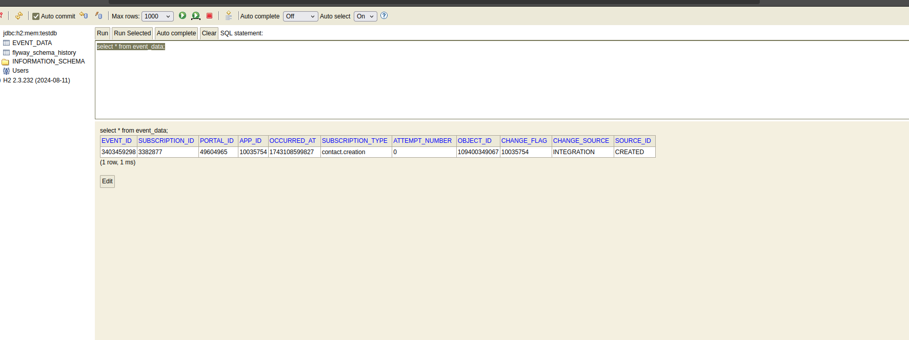

# 📘 HubSpot Integration Demo

Essa aplicação é uma API REST no formato conector de integração para utilizar a autenticação utilizando
o protocolo OAuth com o HubSpot. A Aplicação também fornece endpoints para a criação de contatos utilizando
a API CRM do HubSpot.
---
## 🚀 Execução e Validação do Projeto

### 1. Clone o Repositório

```
git clone https://github.com/diegotrevisancc/hubspot-demo-integration
```
- É necessário ter instalado JDK 21

### 2. HubSpot

- Crie uma conta de desenvolvedor no HubSpot https://developers.hubspot.com/
- Crie um novo aplicativo

- Na parte de autenticação na seção "URLs de redirecionamento", insira a seguinte url:
``localhost:8080/authentication/webhook/oauth``
- Na parte escopos, selecione os seguintes escopos necessários:
```
crm.objects.contacts.read
crm.objects.contacts.write
crm.schemas.contacts.read
crm.schemas.contacts.write
oauth
```
- O resultado da tela de autenticação deve ser similar ao print abaixo

- Copie o id do cliente e o segredo do cliente e insira no arquivo .env do projeto de forma que siga o seguinte
exemplo:
```
CLIENT_ID=466f3bf5-1e8b-4c4c-9416-08519e0f123
CLIENT_SECRET=2eb7adba-7593-4aea-b46a-b484b5fc6123
REDIRECT_URL=http://localhost:8080/authentication/webhook/oauth
```
- Selecione criar aplicativo!

### 3. Dando start no projeto!
- Abra o projeto com sua IDE de preferência
- No Intellij, habilite arquivos de variáveis de ambiente

- Procure pelo arquivo .env do projeto

- Após isso, inicialize a execução!
- O projeto estará rodando na porta 8080 da sua máquina

### 4. Instalando o NGrok
Para utilizar Webhooks disparados por eventos no HubSpot, é necessário termos um endpoint
exposto na internet. Para essa tarefa, estaremos utilizando o NGrok, um serviço simples e muito poderoso,
que nos permite expor um endpoint rapidamente. <b>O Ngrok possui um free tier gratuíto e excelente
para testar demos de aplicações!</b>

- Crie uma conta no Website e faça a instalação do CLI conforme seu Sistema Operacional https://dashboard.ngrok.com/get-started/setup/linux
- Após a instalação, execute o comando ngrok http 8080.
- Copie a URL fornecida, exemplo no print abaixo


### 5. Configurando Webhook no HubSpot
- Na tela de configuração de webhooks no aplicativo HubSpot, adicione o sufixo na URL copiada do NGROK /contact/webhook/contact-created
A url final deve se parecer com essa:
```
https://e873-2804-14d-4ce4-842d-ce46-357d-da1c-f0b1.ngrok-free.app/contact/webhook/contact-created
```
- Selecione criar assinatura e selecione os seguintes objetos/eventos:

- Por final, ative a assinatura


### 6. Testando a aplicação
- A api fornece os seguintes endpoints:
```
GET http://localhost:8080/authentication/install -- usado para resgatar a URL de instalação do aplicativo
POST http://localhost:8080/contact/create - usado para a criação de contatos

Os demais endpoints são utilizados como webhooks para a interação com o HubSpot.
```

A collection do Postman está disponível nos arquivos do projeto sobre o nome de
```HubSpot.postman_collection.json```

Autenticação e Autorização
1. Utilize o endpoint /authentication/install para buscar a URL de instalação do Aplicativo
2. Abra a URL no navegador e forneça todas as permissões ao aplicativo
3. Ao final, copie o accessToken exibido no navegador

Criando um contato
1. Insira o access token no cabeçalho de autorização do endpoint

2. No body da requisição, escolha um nome, sobrenome e email para o contato
3. Envie a requisição

Validando o recebimento do Webhook
- Tanto no console do NGrok, quanto na aba de monitoramento do HubSpot, podemos visualizar o 
que o evento foi recebido com sucesso.

- Todos os eventos também podem ser visualizados na tabela do banco de dados H2 configurado nesse projeto.
Vale ressaltar que eventos com o mesmo ID não serão salvos!
- Para acessar o console do H2 insira a seguinte URL no navegador
```http://localhost:8080/h2-console/```
O login padrão é: 
- usuario: demo
- senha: demo
- Após realizar o login execute a seguinte consulta e visualize um resultado similar
```select * from event_data```
